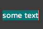
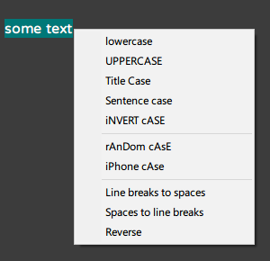
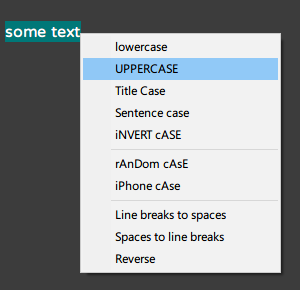

<!-- README.md -->

# HACaseWizard
> An AutoHotkey script to change case of selected text

### Download executable on [Releases](https://github.com/GhostShadow0316/HACaseWizard/releases)

---

### Features
- `lowercase`: Converts text to lowercase
- `UPPERCASE`: Converts text to uppercase
- `Title Case`: Capitalize the first letter and lowercase the rest of every word
- `Sentence case`: Capitalize the first letter and lowercase the rest of every sentence
- `iNVERT cASE`: Invert the cases

- `rAnDom cAsE`: Randomize the cases
- `iPhone cAse`: Capitalize the second letter and lowercase the rest of every word

- `Line breaks to spaces`: Converts line breaks to spaces
- `Spaces to line breaks`: Converts spaces to line breaks
- `Reverse`: Reverse the order of letter

---

### Installation

1. Download and install [AutoHotkey](https://www.autohotkey.com/)
1. Go to [Releases](https://github.com/GhostShadow0316/HACaseWizard/releases) to download the latest .ahk version
1. Double-click to run

#### Run on startup
1) Press <kbd>win + r</kbd> and type `shell:startup` then press <kbd>Enter</kbd>
1) Paste the file in the folder

---

### How to use

1. Run the script

2. Select some text

  

3. Press <kbd>Ctrl + CapsLock</kbd> to show the menu

  

4. Select the case you want either by mouse or arrow keys

  

5. Click or enter key to apply!

  

---

- latest update on 2024-03-31
