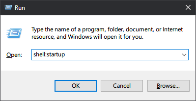

<!-- README.md -->

# HACaseWizard
> An AutoHotkey script to change case of selected text

### Download executable on [Releases](https://github.com/GhostShadow0316/HACaseWizard/releases)

### View [CHANGELOG](https://github.com/GhostShadow0316/HACaseWizard/blob/master/CHANGELOG.md) here

---

### Features
- `lowercase`: Converts text to lowercase
- `UPPERCASE`: Converts text to uppercase
- `Title Case`: Capitalize the first letter and lowercase the rest of every word
- `Sentence case`: Capitalize the first letter and lowercase the rest of every sentence
- `iNVERT cASE`: Invert the cases

- `rAnDom cAsE`: Randomize the cases
- `iPhone cAse`: Capitalize the second letter and lowercase the rest of every word

- `Line breaks to spaces`: Converts line breaks to spaces
- `Spaces to line breaks`: Converts spaces to line breaks
- `Lower Sequential Capital Letters`: lowercase the double capital letters (or triple or more!)
- `Reverse`: Reverse the order of letter

---

### Run the Script

1. Go to [Releases](https://github.com/GhostShadow0316/HACaseWizard/releases) to download the latest .zip file
1. Extract it and navigate into the folder
1. Double-click the `.exe` file to run

#### Run on startup
1. Press <kbd>win + r</kbd> and type `shell:startup` then press <kbd>Enter</kbd>

   

2. Paste the `.exe` file in the folder

#### Run the `.ahk` file
1. Download and install [AutoHotkey](https://www.autohotkey.com/)
1. Double-click the `.ahk` file in the extracted folder to run

---

### How to use

1. Run the script

2. Select some text

  

3. Press <kbd>Ctrl + CapsLock</kbd> to show the menu

  

4. Select the case you want either by mouse or arrow keys

  

5. Click or enter key to apply!

  

---

### Extend the Functionality

#### Create an Extension
1. Go to `cases/extension/` folder and copy the `template.ahk` file
1. Name it whatever you want
1. Modify it with the instruction in it

#### Create an Extension
1. Go to `cases/extension/` folder and paste the extension file
1. Open it and see the case_map area
1. Open `config/config.ini` and add the extension cases into it
1. set `custom_order = true`
1. restart the script

---
- latest update on 2024-04-21
